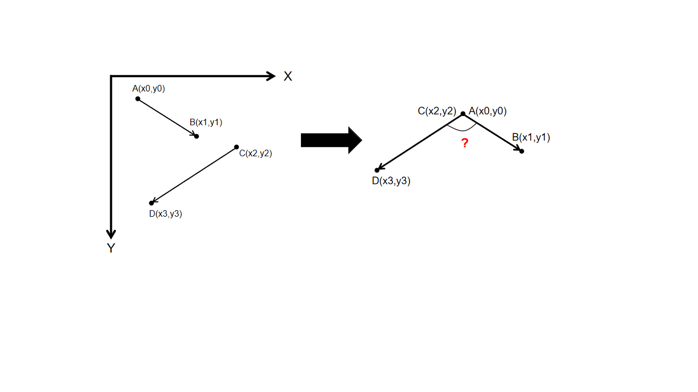
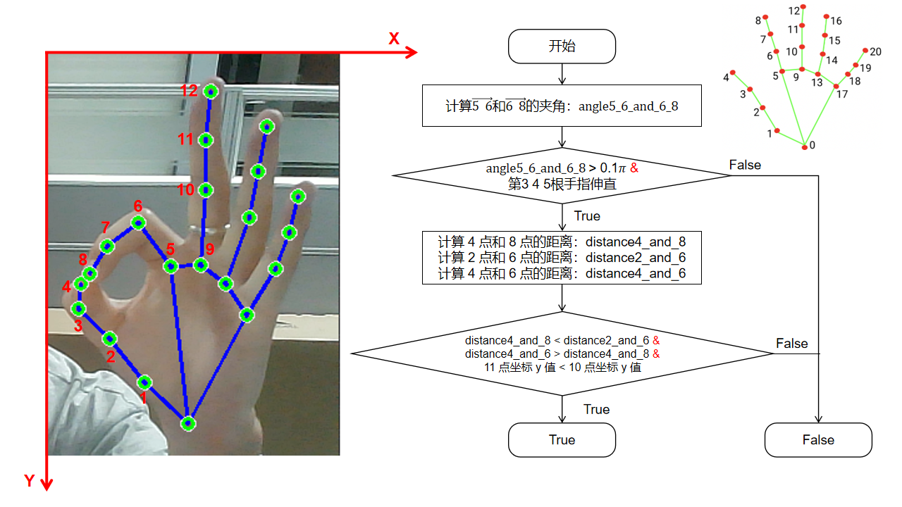
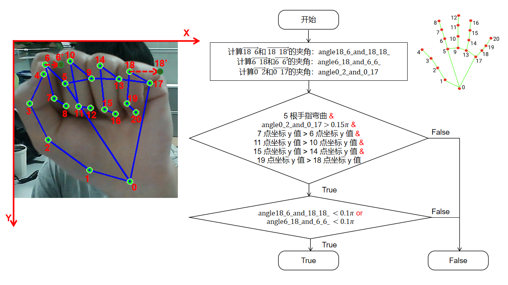
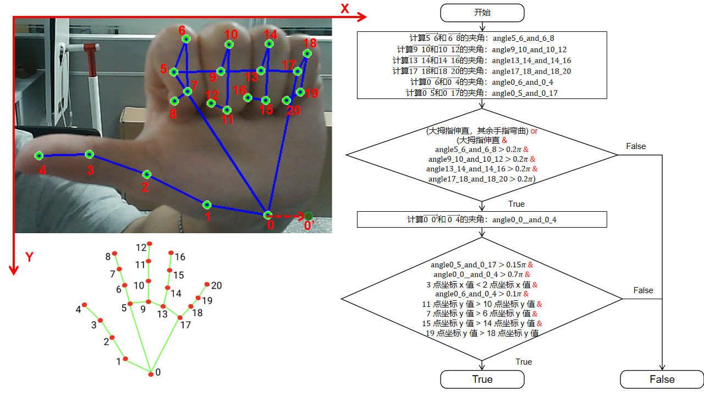
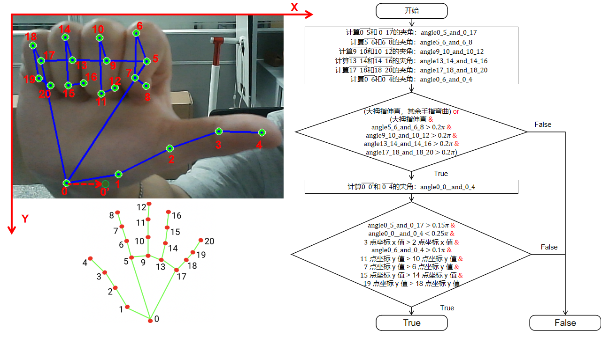
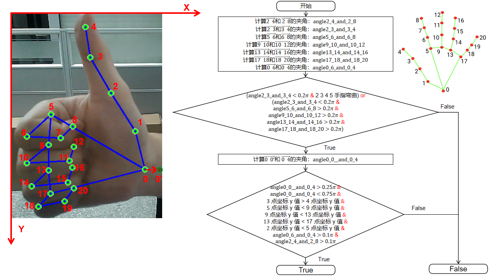
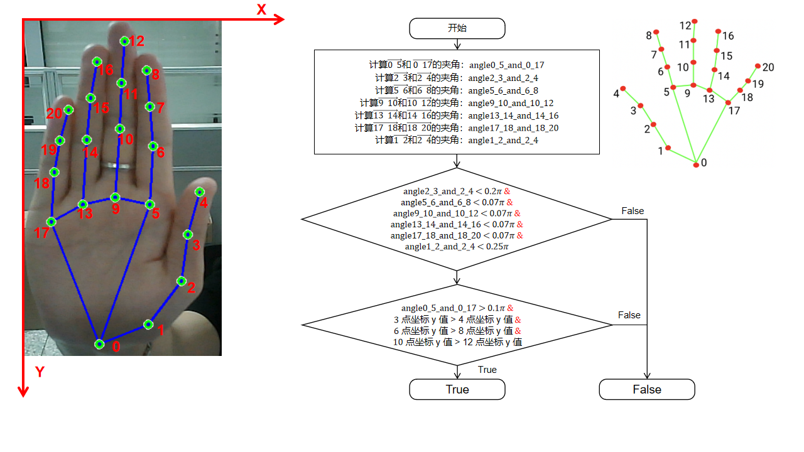

# Gesture Recognition Based on MediaPipe

## 0. Features

> Using the Google MediaPipe framework.
>
> Provide recognition of 6 gestures.

## 1. Prepare

### 1.1 Point Information

There are a total of 21 key points on the hand, as shown in the following figure:


The location information is as follows:

> ```
> WRIST = 0
> THUMB_CMC = 1
> THUMB_MCP = 2
> THUMB_IP = 3
> THUMB_TIP = 4
> INDEX_FINGER_MCP = 5
> INDEX_FINGER_PIP = 6
> INDEX_FINGER_DIP = 7
> INDEX_FINGER_TIP = 8
> MIDDLE_FINGER_MCP = 9
> MIDDLE_FINGER_PIP = 10
> MIDDLE_FINGER_DIP = 11
> MIDDLE_FINGER_TIP = 12
> RING_FINGER_MCP = 13
> RING_FINGER_PIP = 14
> RING_FINGER_DIP = 15
> RING_FINGER_TIP = 16
> PINKY_MCP = 17
> PINKY_PIP = 18
> PINKY_DIP = 19
> PINKY_TIP = 20
> ```


### 1.2 Angle Measurement



## 2. Usage

### 2.1 Gesture Judgment Method

#### 2.1.1 OK Gesture



#### 2.1.2 Return Gesture



#### 2.1.3 Left Gesture



#### 2.1.4 Right Gesture



#### 2.1.5 Like Gesture



#### 2.1.6 Pause Gesture



### 2.2 Function of Code Files

- `gesture_judgment.py`：Defined functions such as finger state and gesture discrimination methods.
- `main.py`：Main function, obtain the required key point data, and plot.

Running the following code:

```python
python main.py
```

## 3. Notice

When the gesture remains unchanged for 30 consecutive frames, the gesture will be returned; otherwise, recognition will continue.

## 4. License

This project is licensed under the Apache 2.0 license. For detailed information, please refer to the LICENSE file.

## 5. Acknowledgement

> CSDN: [王乐予-CSDN博客](https://blog.csdn.net/qq_42856191?type=blog)
>
> Google：[ai.google.dev/edge/mediapipe/solutions/vision/hand_landmarker?hl=zh-cn](https://ai.google.dev/edge/mediapipe/solutions/vision/hand_landmarker?hl=zh-cn)
